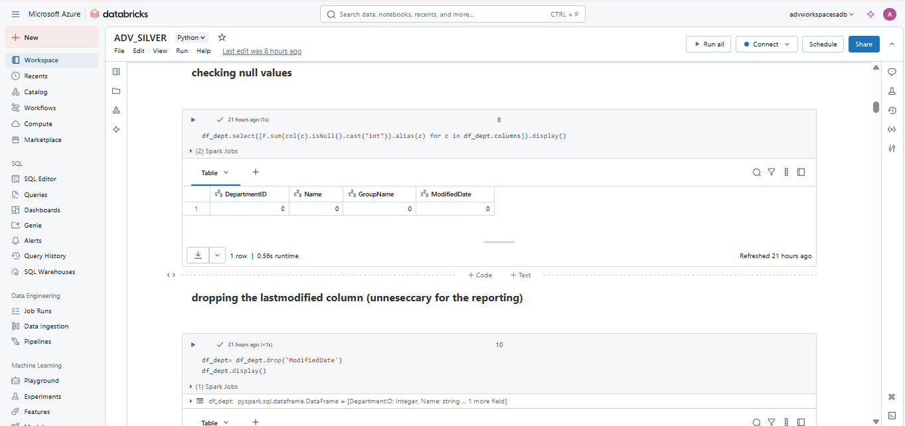

# 🚀 End-to-End Data Engineering Pipeline with Microsoft Azure

## 📌 Project Overview

This project demonstrates the implementation of a complete end-to-end ETL pipeline using Microsoft Azure services. The pipeline extracts data from an on-premises SQL Server database, processes and transforms it across various Azure services, and presents the final data through rich, interactive Power BI dashboards.

The project simulates a real-world enterprise data pipeline and follows industry-standard practices for data movement, transformation, security, and visualization.

---

## 🧰 Tools & Technologies Used

| Tool / Service         | Purpose                                                |
|------------------------|--------------------------------------------------------|
| **SQL Server 2019**    | Source database (AdventureWorks2019)                  |
| **SSMS**               | SQL query development and database management          |
| **Azure Data Factory** | Orchestrating and automating data movement             |
| **Self-hosted IR**     | Secure connection to on-prem SQL Server                |
| **Azure Data Lake Gen2** | Scalable cloud storage (Bronze, Silver, Gold layers)  |
| **Azure Key Vault**    | Secure secret and credential management                |
| **Azure Databricks**   | Data transformation using PySpark                      |
| **Azure Synapse Analytics** | Data modeling, external tables, and querying       |
| **Power BI**           | Data visualization and dashboard creation              |

---

## 🔄 ETL Pipeline Architecture

### 1. **Data Source**
- Restored and explored the **AdventureWorks2019** database in SQL Server 2019.

### 2. **Data Ingestion**
- Configured **Azure Data Factory (ADF)** to connect to the on-prem SQL Server using **Self-hosted Integration Runtime (SHIR)**.
- Built dynamic pipelines to ingest multiple tables automatically.
- 

### 3. **Data Storage**
- Stored data in **Azure Data Lake Storage Gen2** using a multi-layered approach:
  - **Bronze**: Raw data
  - **Silver**: Cleaned and filtered data
  - **Gold**: Aggregated and ready-for-reporting data

### 4. **Security**
- Managed secrets (like DB credentials) using **Azure Key Vault** for enhanced security.
 

### 5. **Data Transformation**
- Cleaned, transformed, and enriched data using **Azure Databricks (PySpark)**.

### 6. **Data Modeling**
- Created **views** and **external tables** using **Azure Synapse Analytics** for seamless querying.

### 7. **Data Visualization**
- Developed interactive dashboards in **Power BI** using Gold layer data to derive business insights.

---

## 👤 Author

**Amit Karmakar**  
[LinkedIn](https://www.linkedin.com/in/amit-karmakar-355817258/) 

> 💬 Feel free to reach out for feedback, questions, or collaboration!

---

